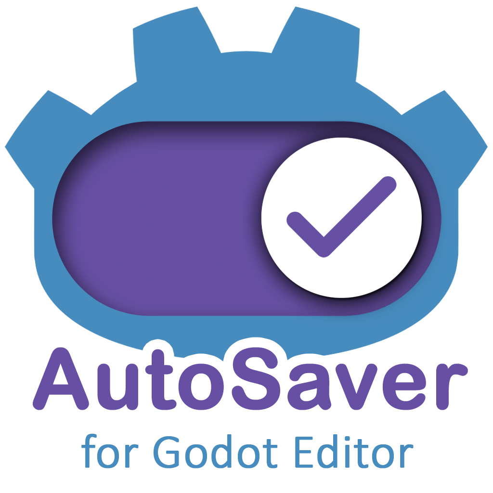
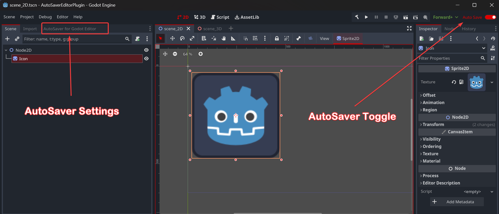
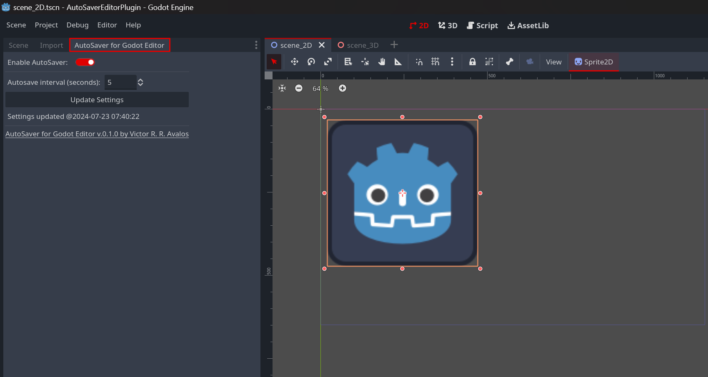

# AutoSaver Toggle for Godot Editor (C#)

AutoSaver is a peace-of-mind plugin for Godot 4 that enables a toggle to automatically save the currently open scenes and files based on a timer schedule (default is 60 seconds) and/or when the application loses focus. The plugin has some optional configuration to customize the experience.




---

> [!NOTE]
> The **AutoSaver Toggle for Godot Editor** is currently in early development. While it is functional, it may have unexpected behaviors. I welcome feedback and contributions to improve its stability and features such as porting to GDScript. Check **Contributions** section for more info.

---

### Motivation 📌

You know how valuable your time is and **how frustrating it is to lose [unsaved work](https://medium.com/@victoravalos/short-guide-to-recover-word-documents-82ca4c17df08)**.😱

## Features 📣

- Toggle autosave functionality in the Godot editor
- Prevent saving during active editing (scenes)
- Integration with Godot's built-in autosave features
- Easy-to-use settings panel in the Godot editor



### What this plugin does ✅

- Automatically saves open text files (.gd, .txt, etc.) and scene files (.tscn) in the Godot editor at regular intervals.
- Provides an optional feature to save files when the Godot editor loses focus (disabled by default).
- Compatible with `GDScript`-only projects when using Godot Engine for .NET (see **Troubleshoothing**)


### What this plugin does not do ❌.

- This plugin does not create an autosave system for your game projects.
- It's not a replacement for version control systems like Git.
- This plugin doesn't create backups or multiple versions of your files; it simply saves the current state of open files in Godot.

## Minimum Requirements

- [Godot Engine - .NET](https://godotengine.org/download/windows/) (version 4.2.2 or higher)
- A Godot project configured to use C# (see **Troubleshooting** for more info)

### Installation 🔧

1. Download the latest version from the GitHub repository.
2. Put the plugin folder `autosaver_editor` into the `addons` folder of your Godot project.
3. Enable the plugin in Godot: `Project > Project Settings > Plugins > AutoSaver Toggle for Godot Editor`.

### Troubleshooting ⚠️

If you encounter the following error when activating the plugin

> *"Unable to load addon script from path: 'res://addons/autosaver_editor/AutoSaverEditorPlugin.cs'. This might be due to a code error in that script. Disabling the addon at 'res://addons/autosaver_editor/plugin.cfg' to prevent further errors."*

Please make sure that

1. Your Godot project is properly set up as a .NET project.
2. There's a `.csproj` file in your project root (Godot automatically creates this when you add your first `C#` script).
3. Your project has been successfully compiled ("Build Project" button).

#### To set up your project:

1. Use the [Godot Engine - .NET](https://godotengine.org/download/windows/) version for your project.
2. Create a simple .cs file in the FileSystem dock (right-click > New Script > C# Script).
3. Wait a few seconds (Godot needs time to create the CS project) and check the root folder.
4. Before activating the plugin, build the project by clicking the hammer icon 🔨 ("Build Project" button) in the top right menu (next to the play button).
5. After a successful build, try to activate the plugin again.

If the issue persists after following these steps, please check the Godot console output for more detailed error messages and make sure that all plugin files are placed correctly in your project structure.


## Configuration ⚙️

By default, the plugin is set to a 60 second interval.   
An optional configuration can be set in the `settings.ini` file located in the root folder of this plugin.

After activating the plugin, you can access its settings through the plugin panel, where you can adjust the autosave interval:  



The interval configuration for saving files (.gd, .txt, etc.) in the Script Editor is directly linked to the built-in Godot editor configuration for saving files: [ Godot UI: Editor > Editor Settings > Interface  > Text Editor> Behavior > Autosave Interval Secs](https://docs.godotengine.org/es/4.x/classes/class_editorsettings.html#class-editorsettings-property-text-editor-behavior-files-autosave-interval-secs).

The optional *"autosave on focus loss"* configuration is disabled by default, it uses the built-in Godot editor autosave on focus loss configuration [Godot UI: Editor > Editor Settings > Interface > Editor > Save on Focus Loss](https://docs.godotengine.org/es/4.x/classes/class_editorsettings.html#class-editorsettings-property-interface-editor-save-on-focus-loss). To enable it, edit the `settings.ini` file:
```
use_gd_editor_save_on_focus_loss=true
```

## Known issues 🚩

- Hovering over some parts of the Godot editor's UI (such as the plugin's UI elements) can prevent the plugin's internal trigger from working.
- The "autosave on focus loss" option, which relies on Godot's built-in editor settings ["Save on Focus Loss"](https://docs.godotengine.org/es/4.x/classes/class_editorsettings.html#class-editorsettings-property-interface-editor-save-on-focus-loss),caused some .cpp errors in the Godot output console during testing while writing this plugin.


## Contributions 🤲

Contributions are welcome! If you'd like to help create the `GDScript` version or improve the existing `C#` version, please feel free to submit pull requests or open issues to this GitHub repository.

## License ⚖️

This project is licensed under the MIT License - see the [LICENSE](LICENSE) file for details.

If this code helps you and if you'd like to give me credit,  [Victor R. R. Avalos](https://github.com/vrravalos/), it would be greatly appreciated. 🙂
